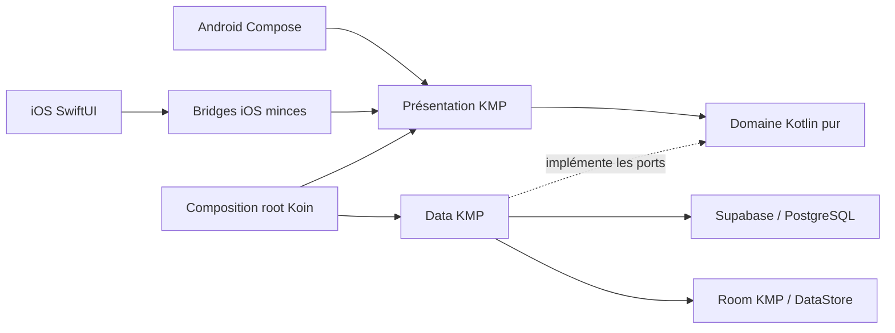

# Architecture KWABOR

> Deux interfaces mobiles natives consomment un socle Kotlin Multiplatform, avec Supabase comme
> backend et Room/DataStore comme persistance locale.

## Vue d'ensemble

| Zone | Responsabilité actuelle |
| --- | --- |
| `androidApp` | Activity, navigation et UI Compose Multiplatform Android |
| `iosApp` | Cycle de vie, navigation et UI SwiftUI native |
| `shared` | Domaine pur, data, états de présentation, bridges et composition Koin |
| `supabase` | PostgreSQL, Auth, RLS, RPC et Edge Function de suppression de compte |
| Room KMP | Cache Explore v2 et outbox Like/Favori partagés Android/iOS |
| DataStore KMP | Ville Explore, locale et devise d'affichage |



## Frontières obligatoires

La direction des dépendances reste :

```text
presentation -> domain <- data
```

- `domain` contient modèles, erreurs typées et interfaces de repositories. Il n'importe ni Compose,
  ni Supabase, ni Room, ni Ktor, ni SDK plateforme.
- `data` implémente les interfaces du domaine. DTO Supabase, entités Room et modèles domaine restent
  séparés par des mappers explicites.
- `presentation` porte les états immuables, intents et runtimes UDF partagés. Les vues Android et iOS
  observent ces états et remontent les intentions utilisateur.
- `app` assemble le graphe Koin, le cycle de vie et les dépendances d'exécution.
- `bridge` et `iosMain` exposent des façades Kotlin consommables par Swift sans dupliquer le métier.

Le task Gradle `verifyDomainPurity`, rattaché à `check`, refuse les imports et emplacements interdits
dans le domaine.

## Flux d'une lecture catalogue

1. La vue native envoie une intention au runtime partagé.
2. Le presenter construit une requête métier validée. Pour Explore, le type d'onglet détermine le
   tri v2 serveur ; l'UI renseigne la ville et la catégorie. Le contrat KMP garde un
   `listingClass` optionnel typé, que les surfaces actuelles laissent absent.
3. Le repository Explore tente le cache Room lorsque le flux le prévoit, puis son gateway strict
   interroge `list_catalog_summaries_v2`. Les référentiels et Search conservent leurs contrats v1
   séparés ; aucun classement v2 n'est reproduit côté client.
4. La couche data mappe DTO et erreurs techniques vers le domaine.
5. Le runtime protège les réponses obsolètes et produit un nouvel état immuable.
6. Android Compose ou iOS SwiftUI rend cet état sans effet de bord dans la composition.

Les lectures publiques ne retournent que des fiches publiées. Les actions privées utilisent la
session sécurisée plateforme et les règles RLS/RPC du backend.

## Persistance locale

- Room KMP version 4 stocke les snapshots Explore, fiches canoniques, positions, référentiels ville/
  catégorie et l'outbox Like/Favori liée au compte. Les migrations automatiques `1 -> 2`, `2 -> 3`
  puis `3 -> 4` et les quatre schémas JSON sont contrôlés par `check`.
- Le cache `explore-feed:v2` persiste le snapshot serveur en microsecondes, les métadonnées de carte
  v2 et l'autorité sponsorisée. Toute page suivante non vide doit appartenir au même snapshot ; le
  mur cumulé conserve au plus deux sponsors placés avant tout résultat organique.
- Les colonnes ajoutées en v3 restent nullables pour relire les snapshots historiques v1. Le
  repository ne consulte cette clé legacy que si aucun snapshot v2 n'existe, n'autorise jamais
  d'append depuis ce repli offline et exige le contrat complet pour toute nouvelle écriture v2.
- Si la politique device-bound interdit le disque et force Room en mémoire, les caches publics
  restent utilisables pour la session mais la capacité d'outbox durable est désactivée. Toute
  mutation Like/Favori ou purge de suppression échoue alors comme stockage local indisponible,
  avant optimisme ou transport.
- L'outbox applique l'écriture locale avant transport, coalesce le dernier état souhaité par
  compte/fiche/type et conditionne chaque confirmation ou retry à l'identifiant d'opération. Le
  coordinateur partagé draine uniquement le compte et le scope de session attendus ; les RPC v2
  vérifient aussi cet identifiant de compte contre le JWT avant toute mutation.
- Le flux mémoire de confirmations est borné, sans garantie exactly-once. Un overflow produit des
  watermarks confluents d'opération terminale et de séquence de livraison par scope ; Explore et
  Favoris réhydratent leurs fiches par fenêtres, revalident seulement les événements retardés couverts
  et n'acquittent la réconciliation qu'après lecture locale réussie. La file durable Favoris est
  bornée séparément ; ses refus sont coalescés en une dette O(1), publiée après drainage et conservée
  jusqu'à l'acquittement exact du scope et du watermark.
- DataStore stocke uniquement des préférences légères. Il ne stocke ni token, ni outbox, ni donnée
  métier synchronisable.
- Les tokens d'authentification utilisent le stockage sécurisé plateforme : Android Keystore/
  EncryptedSharedPreferences et iOS Keychain derrière des adaptateurs minces.
- Sans moniteur réseau natif, le drain est réveillé par l'enqueue, la session, le foreground, le
  retour d'écran, le retry manuel et sa prochaine échéance bornée à cinq minutes.

## Backend et sécurité

- Supabase fournit Auth, PostgREST/RPC et PostgreSQL. La première Edge Function traite la suppression
  de compte ; les buckets et le pipeline Storage métier restent planifiés dans `MEDIA-001`.
- Les tables exposées appliquent RLS et grants explicites ; les décisions d'autorité ne dépendent
  jamais d'un simple masquage UI.
- Les opérations sensibles dérivent l'identité de `auth.uid()` et utilisent des fonctions dont le
  `search_path` et les droits d'exécution sont bornés.
- La validation serveur des paiements est un invariant cible non négociable. Le dépôt ne contient
  encore que leurs fondations de données ; ledger, webhooks, idempotence et rapprochement restent à
  livrer, et aucune clé secrète fournisseur ne doit résider dans les applications.
- Les logs et analytics excluent PII, tokens et texte utilisateur libre.

## Différences plateforme

| Sujet | Android | iOS |
| --- | --- | --- |
| UI | Compose Multiplatform | SwiftUI natif |
| Navigation | Navigation Compose typée | Navigation SwiftUI et stores natifs |
| Session sécurisée | AndroidX Security/Keystore | Keychain |
| Base Room | `noBackupFilesDir/KwaborRoom`, repli mémoire | `Application Support/KwaborRoom` protégé, non sauvegardé, repli mémoire |
| Validation native | JVM/Android + appareils | Tests Swift et simulateur sur macOS ; appareils iOS à qualifier |

`expect`/`actual` reste réservé aux différences réelles de plateforme. Aucun troisième client
applicatif ne doit être ajouté.

## État actuel et cible

| Capacité | État actuel | Cible suivie |
| --- | --- | --- |
| Auth/onboarding | Implémenté, fournisseurs réels à provisionner | Preuves staging/appareils |
| Explore/détail | Mur v2 et parcours principal partiellement livrés | Drawer avancé, recherche filtrée, avis et actions restantes |
| Offline | Cache/préférences et outbox Like/Favori locale, validation SYNC-001 en cours | Brouillons synchronisés et preuves exact-head |
| Social/B2B/paiement/IA | Contrats ou fondations partielles | Parcours V1 complets |
| Distribution | Workflows d'artefacts présents | AAB/TestFlight qualifiés et rollout |

La cible détaillée appartient au [plan V1](v1-production-delivery.md), pas à ce document.

## Décisions associées

- [ADR-0003 — Frontières de modules](adr/0003-module-boundaries.md), historique et remplacé par ADR-0010
- [ADR-0004 — Injection Koin](adr/0004-dependency-injection-koin.md)
- [ADR-0005 — Supabase et RLS](adr/0005-supabase-rls-security.md)
- [ADR-0010 — Mobile-only et SwiftUI](adr/0010-mobile-only-swiftui-team-access.md)
- [ADR-0011 — Room KMP](adr/0011-room-kmp-local-persistence.md)
- [ADR-0015 — Navigation mobile native](adr/0015-native-mobile-navigation.md)
- [ADR-0027 — Persistance locale liée à l’appareil](adr/0027-device-bound-local-persistence.md)
- [ADR-0034 — Classement Explore v2 et raccord mobile](adr/0034-versioned-explore-ranking-and-sponsored-cap.md)
- [ADR-0035 — Outbox durable Like/Favori](adr/0035-durable-viewer-interaction-outbox.md)

Étape suivante : [lire le modèle de données](data-model.md).
