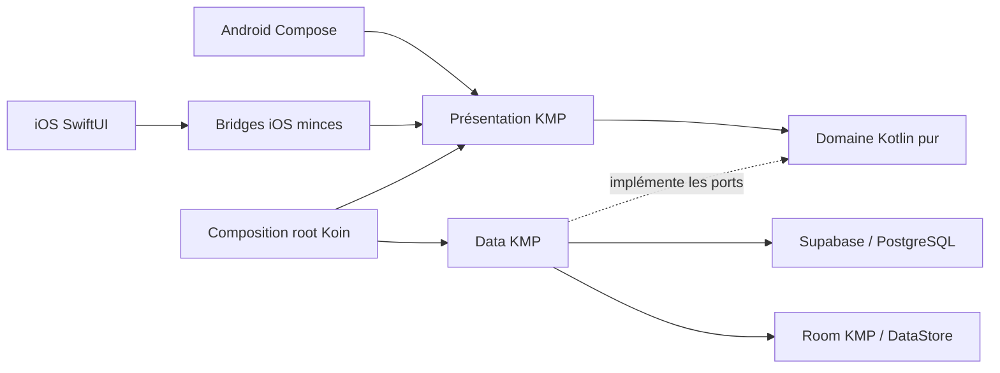

# Architecture KWABOR

> Deux interfaces mobiles natives consomment un socle Kotlin Multiplatform, avec Supabase comme
> backend et Room/DataStore comme persistance locale.

## Vue d'ensemble

| Zone | Responsabilité actuelle |
| --- | --- |
| `androidApp` | Activity, navigation et UI Compose Multiplatform Android |
| `iosApp` | Cycle de vie, navigation et UI SwiftUI native |
| `shared` | Domaine pur, data, états de présentation, bridges et composition Koin |
| `supabase` | PostgreSQL, Auth, RLS, RPC et Edge Function de suppression de compte |
| Room KMP | Cache Explore structuré partagé Android/iOS |
| DataStore KMP | Ville Explore, locale et devise d'affichage |



## Frontières obligatoires

La direction des dépendances reste :

```text
presentation -> domain <- data
```

- `domain` contient modèles, erreurs typées et interfaces de repositories. Il n'importe ni Compose,
  ni Supabase, ni Room, ni Ktor, ni SDK plateforme.
- `data` implémente les interfaces du domaine. DTO Supabase, entités Room et modèles domaine restent
  séparés par des mappers explicites.
- `presentation` porte les états immuables, intents et runtimes UDF partagés. Les vues Android et iOS
  observent ces états et remontent les intentions utilisateur.
- `app` assemble le graphe Koin, le cycle de vie et les dépendances d'exécution.
- `bridge` et `iosMain` exposent des façades Kotlin consommables par Swift sans dupliquer le métier.

Le task Gradle `verifyDomainPurity`, rattaché à `check`, refuse les imports et emplacements interdits
dans le domaine.

## Flux d'une lecture catalogue

1. La vue native envoie une intention au runtime partagé.
2. Le presenter construit une requête métier validée.
3. Le repository tente le cache Room lorsque le flux le prévoit, puis interroge le RPC Supabase.
4. La couche data mappe DTO et erreurs techniques vers le domaine.
5. Le runtime protège les réponses obsolètes et produit un nouvel état immuable.
6. Android Compose ou iOS SwiftUI rend cet état sans effet de bord dans la composition.

Les lectures publiques ne retournent que des fiches publiées. Les actions privées utilisent la
session sécurisée plateforme et les règles RLS/RPC du backend.

## Persistance locale

- Room KMP version 2 stocke les snapshots Explore, fiches canoniques, positions et référentiels ville/
  catégorie. Les schémas JSON versionnés sont contrôlés par `check`.
- DataStore stocke uniquement des préférences légères. Il ne stocke ni token, ni outbox, ni donnée
  métier synchronisable.
- Les tokens d'authentification utilisent le stockage sécurisé plateforme : Android Keystore/
  EncryptedSharedPreferences et iOS Keychain derrière des adaptateurs minces.
- La future outbox Like/Favori reste planifiée dans `SYNC-001` ; la queue courante en mémoire n'est
  pas une garantie de synchronisation après arrêt du processus.

## Backend et sécurité

- Supabase fournit Auth, PostgREST/RPC et PostgreSQL. La première Edge Function traite la suppression
  de compte ; les buckets et le pipeline Storage métier restent planifiés dans `MEDIA-001`.
- Les tables exposées appliquent RLS et grants explicites ; les décisions d'autorité ne dépendent
  jamais d'un simple masquage UI.
- Les opérations sensibles dérivent l'identité de `auth.uid()` et utilisent des fonctions dont le
  `search_path` et les droits d'exécution sont bornés.
- La validation serveur des paiements est un invariant cible non négociable. Le dépôt ne contient
  encore que leurs fondations de données ; ledger, webhooks, idempotence et rapprochement restent à
  livrer, et aucune clé secrète fournisseur ne doit résider dans les applications.
- Les logs et analytics excluent PII, tokens et texte utilisateur libre.

## Différences plateforme

| Sujet | Android | iOS |
| --- | --- | --- |
| UI | Compose Multiplatform | SwiftUI natif |
| Navigation | Navigation Compose typée | Navigation SwiftUI et stores natifs |
| Session sécurisée | AndroidX Security/Keystore | Keychain |
| Base Room | Builder Android mince | Builder iOS mince dans Application Support |
| Validation native | JVM/Android + appareils | Tests Swift et simulateur sur macOS ; appareils iOS à qualifier |

`expect`/`actual` reste réservé aux différences réelles de plateforme. Aucun troisième client
applicatif ne doit être ajouté.

## État actuel et cible

| Capacité | État actuel | Cible suivie |
| --- | --- | --- |
| Auth/onboarding | Implémenté, fournisseurs réels à provisionner | Preuves staging/appareils |
| Explore/détail | Parcours principal partiellement livré | Recherche, avis et actions restantes |
| Offline | Cache et préférences persistants | Outbox et brouillons synchronisés |
| Social/B2B/paiement/IA | Contrats ou fondations partielles | Parcours V1 complets |
| Distribution | Workflows d'artefacts présents | AAB/TestFlight qualifiés et rollout |

La cible détaillée appartient au [plan V1](v1-production-delivery.md), pas à ce document.

## Décisions associées

- [ADR-0003 — Frontières de modules](adr/0003-module-boundaries.md), historique et remplacé par ADR-0010
- [ADR-0004 — Injection Koin](adr/0004-dependency-injection-koin.md)
- [ADR-0005 — Supabase et RLS](adr/0005-supabase-rls-security.md)
- [ADR-0010 — Mobile-only et SwiftUI](adr/0010-mobile-only-swiftui-team-access.md)
- [ADR-0011 — Room KMP](adr/0011-room-kmp-local-persistence.md)
- [ADR-0015 — Navigation mobile native](adr/0015-native-mobile-navigation.md)

Étape suivante : [lire le modèle de données](data-model.md).
