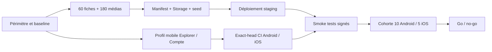

# Plan d'exécution — V1 bêta fermée Kwabor

> Plan opérationnel tâche par tâche pour livrer le profil accepté dans ADR-0036, ouvrir une cohorte
> Android/iOS et prendre une décision de mise en production fondée sur des preuves.

## Objectif unique

Livrer une V1 bêta fermée Kwabor réellement utilisable sur Android et iOS, distribuée par les
canaux internes officiels, qui permet à une cohorte contrôlée de découvrir le catalogue, rechercher,
ouvrir une fiche, utiliser Like/Favori hors ligne et gérer son compte, avec exactement 60 fiches de
démonstration complètes et 180 images réalistes validées, sans exposer les surfaces différées.

L'objectif est atteint uniquement lorsque les conditions suivantes sont toutes vraies :

- les artefacts Android et iOS signés et la CI protégée partagent une provenance commune dont
  `expected_sha` désigne le même exact-head validé ;
- la navigation visible est limitée à `Explorer · Compte` et aucun deep link ne contourne cette
  allowlist ;
- le staging protégé contient exactement 60 fiches publiées et 180 médias conformes au manifeste ;
- le parcours invité et le parcours authentifié fonctionnent en ligne, sur réseau dégradé et après
  redémarrage hors ligne ;
- Like, Favori, cache, outbox, session, déconnexion et suppression de compte restent sûrs ;
- la CI, la sécurité Supabase, le rollback, l'accessibilité et la performance critique sont prouvés ;
- 10 appareils Android et 5 iPhone terminent sept jours complets J1–J7 sur le même RC, avec zéro
  P0/P1 ouvert, au moins 200 sessions consenties observées et au moins 99,5 % de sessions sans crash ;
- une décision propriétaire explicite clôt la cohorte par `go`, `go avec correctifs` ou `no-go`.

Dans ce plan, « mise en production de la bêta » signifie : builds signés distribués via le canal
interne Google Play et TestFlight à une liste fermée, connectés au staging protégé. Cela ne signifie
ni publication publique, ni chargement automatique du corpus fictif dans Supabase Production.

## État d'exécution au 20 août 2026

| Gate | État | Preuve acquise | Prochaine condition de sortie |
| --- | --- | --- | --- |
| G0 — scope | **vert** | ADR accepté, profil catalogue fermé, branche/worktree dédiés | maintenir le périmètre sans réintroduire de surface différée |
| G1 — catalogue | **versionné, CI main verte** | PR `#60`, exactement 60 fiches et 180 JPEG, manifestes et planches-contact conformes | préserver ces invariants sur le futur exact-head intégré |
| G2 — données | **prêt localement** | seed/rollback, Storage et catalogue fail-closed, plus workflow DB fresh-empty v2 sous verrou staging commun | publier le delta, obtenir la CI exact-head puis exécuter sur le vrai staging protégé |
| G3 — mobile | **fonctionnel local, P2 iOS ouverte** | profil `Explorer · Compte`, sessions consenties et sonde FUV fusionnés ; un cleanup Firebase froid impossible place seulement l'observabilité en quarantaine OFF et laisse auth/catalogue utilisables | qualifier sur macOS la transaction privacy et décider la P2 de reprise Firebase avant la CI exact-head |
| G4 — exact-head | **en attente CI distante** | validations locales proportionnées possibles, mais aucun commit/PR/run ne porte encore le delta intégré | geler les writers, publier après autorisation puis exécuter une gate protégée sur le même SHA |
| G5 — staging | **en attente externe** | workflows locaux préparés ; aucun projet staging hébergé qualifié ni preuve 60/180 distante | protéger l'Environment, provisionner variables/secrets et exécuter migration, upload, import, rollback et vérification réels |
| G6 — distribution | **en attente externe** | workflows de build/upload préparés sans artefact Store réel | provisionner comptes/credentials, signer, téléverser puis qualifier sur appareils physiques |
| G7 — cohorte | **en attente appareils/cohorte** | protocole et validateur go/no-go locaux ; aucune cohorte réelle exécutée | preflight signé, canary puis 10 Android et 5 iPhone sur le même RC pendant J1–J7 |

Le chemin critique immédiat est la qualification macOS de la transaction privacy iOS, puis
l'intégration publiée et la CI exact-head G4, le vrai staging G5, la distribution G6 et la cohorte G7.
Storage et SQL sont prêts localement. Le parcours mobile reste utilisable lorsque l'observabilité iOS
est mise en quarantaine, mais la reprise froide Firebase et le regrant restent refusés et retryables
tant que le cleanup sûr n'a pas abouti. Les retries actuels ne franchissent pas
`requiresSafeConfiguration` dans ce cas froid ; cette P2 ne ferme ni G3 ni les gates aval.
Aucun échantillon P75 physique (10 cold + 20 warm par plateforme), aucune série réelle de
200 sessions consenties et aucun jour J1–J7 ne sont encore archivés.

## Contraintes de pilotage

1. Correctness, confidentialité et sécurité ne sont jamais échangées contre de la vitesse.
2. Les fonctions hors périmètre sont masquées, pas réécrites ni supprimées du produit cible.
3. Le seed canonique de quatre fixtures reste inchangé ; ses UUID `0101` à `0104` sont réservés et
   l'ensemble des 60 UUID du corpus bêta, opt-in et staging-only, lui est strictement disjoint.
4. Docker et la stack Supabase s'exécutent uniquement dans GitHub Actions.
5. Une tâche n'est dite terminée que lorsque son livrable et sa preuve de sortie existent.
6. La CI protégée s'exécute indépendamment des validations locales. Aucun rerun manuel n'est lancé
   sans preuve nouvelle ; un retry d'infrastructure est permis seulement si sa cause, son run source,
   son propriétaire et son résultat sont tracés.
7. Aucun test global n'est lancé pour un changement purement éditorial ou média.
8. Une PR n'est non-draft que si le lot est complet, documenté, formaté, compilé et testé.

## Chemin critique et parallélisation

Quatre voies avancent en parallèle, avec un seul intégrateur responsable de l'exact-head :

| Voie | Contenu | Peut avancer pendant |
| --- | --- | --- |
| A — Catalogue | fiches, images, manifestes, revue éditoriale | développement mobile et tooling |
| B — Données | seed, Storage, RLS, import, rollback | génération média après gel du schéma JSON |
| C — Mobile | profil bêta, navigation, disclosure, CTA, parcours | génération média et tooling Supabase |
| D — Release | CI, signature, runbooks, appareils, observabilité | tous les lots avant le gel RC |

Le travail est découpé en trois intégrations maximum pour réduire les conflits et le temps de revue :

1. **Catalogue** : contenu, 180 JPEG, manifeste, validateurs et documentation.
2. **Verticale bêta** : seed/Storage, navigation Android/iOS, disclosure et tests ciblés.
3. **Release candidate** : exact-head global, déploiement staging, builds signés et preuves appareil.

## Prévision conditionnelle

La date d'ouverture n'est pas un engagement fixe. Le forecast est recalculé chaque jour à partir du
dernier chemin critique prouvé et ne devient publiable que lorsque les credentials staging/Store,
les fiches applicatives Play Console/App Store Connect, les accords légaux et les groupes de test
existent et sont vérifiés.

| Jalon prévisible | Conditions nécessaires | Délai indicatif après conditions vertes |
| --- | --- | --- |
| catalogue gelé | G0, writers disponibles, génération et revue média opérationnelles | 24–48 h |
| staging qualifié | G1–G4, vrai projet staging, workflow Storage et secrets protégés disponibles | 24–48 h |
| RC téléversé | G5, preflight Store/légal/credentials signé, workflows de release livrés | 12–24 h plus traitement Store |
| cohorte ouvrable | G6–G7, AAB et IPA traités, 15 invitations et appareils confirmés | prochaine fenêtre opérateur sûre |
| décision | sept jours J1–J7 complets sans remise à zéro | fin de J7 après consolidation |

Le forecast expose séparément le temps de travail restant, l'attente de credentials, l'attente des
records Store et le traitement externe. Une indisponibilité externe ne bloque pas les tâches locales
indépendantes, mais aucune date — même annoncée — n'autorise à franchir une gate rouge.

## Phase 0 — Gouvernance et baseline

| ID | Tâche | Livrable / preuve de sortie | Dépendance |
| --- | --- | --- | --- |
| B0.01 | Conserver le travail Notifications dans son worktree dédié | aucun fichier NOTIF dans la branche bêta | aucune |
| B0.02 | Créer une branche et un worktree propres depuis `origin/main` | branche `codex/beta-001-demo-catalog`, HEAD documenté | aucune |
| B0.03 | Accepter le profil de livraison réduit | ADR-0036 `accepté` | décision Produit |
| B0.04 | Définir la navigation autorisée | allowlist `home/profile` écrite et testable | B0.03 |
| B0.05 | Définir ce que « mise en production bêta » recouvre | Play Internal + TestFlight, backend staging protégé ; preflight Store/légal/credentials obligatoire | B0.03 |
| B0.06 | Geler la matrice du corpus | 15×4, 5/famille/ville, total 60 | B0.03 |
| B0.07 | Geler le contrat média | 3 JPEG 960×1280/fichier, 320 Kio max, total 48 Mio | B0.06 |
| B0.08 | Établir les no-go et prérequis externes | P0/P1, secret, hash, rollback, droits média, build/appareil rouge ; comptes, contrats, credentials et records Store listés | B0.03 |
| B0.09 | Créer la matrice d'ownership des fichiers | un writer par fichier pendant les lots parallèles | B0.02 |
| B0.10 | Capturer la baseline exacte | commit, CI post-merge, état du backlog et limites | B0.02 |

**Gate G0 — scope gelé** : B0.01 à B0.10 sont prouvées ; aucune fonction différée n'est requise
pour terminer le parcours catalogue.

## Phase 1 — Corpus éditorial de 60 fiches

| ID | Tâche | Livrable / preuve de sortie | Dépendance |
| --- | --- | --- | --- |
| B1.01 | Isoler les UUID démo des fixtures historiques | 60 UUID démo uniques et tous disjoints des fixtures réservées `0101` à `0104` | B0.06 |
| B1.02 | Rédiger 15 lieux | 5 historiques, 5 nature, 5 marchés ; 5/ville | B0.06 |
| B1.03 | Rédiger 15 événements | détail, lieu même ville, dates relatives, 9 payants/6 gratuits | B0.06 |
| B1.04 | Rédiger 15 hôtels | étoiles, chambres, horaires, équipement, prix/nuit | B0.06 |
| B1.05 | Rédiger 15 restaurants | cuisines, services, horaires, équipement, prix/personne | B0.06 |
| B1.06 | Normaliser noms et slugs | aucune collision UUID/slug, champs dans les bornes DB/mobile | B1.02–B1.05 |
| B1.07 | Normaliser les villes et coordonnées | 20 fiches par ville, coordonnées situées au Bénin | B1.02–B1.05 |
| B1.08 | Neutraliser toute preuve sociale fictive | `ratingAvg=null`, compteurs à zéro, aucun avis | B1.02–B1.05 |
| B1.09 | Ajouter la disclosure éditoriale | tags démo + suffixe de description exact sur 60/60 | B1.02–B1.05 |
| B1.10 | Réserver les contacts techniques | domaine `.test`, aucune personne ou entreprise réelle | B1.03–B1.05 |
| B1.11 | Rédiger trois alts uniques par fiche | 180 alts FR, 60–160 caractères | B1.02–B1.05 |
| B1.12 | Rédiger trois prompts uniques par fiche | 180 prompts sans texte/logo/personne identifiable | B1.11 |
| B1.13 | Valider les quatre fragments JSON | validateur : 60 fiches, distributions/invariants exacts et intersection vide avec `0101`–`0104` | B1.06–B1.12 |
| B1.14 | Faire la revue éditoriale finale | statut approuvé pour chaque fiche ; écarts consignés | B1.13 |

## Phase 2 — Génération et qualification des 180 images

| ID | Tâche | Livrable / preuve de sortie | Dépendance |
| --- | --- | --- | --- |
| B2.01 | Générer les 45 médias Lieux | 15 covers + 30 galeries | B1.12 |
| B2.02 | Générer les 45 médias Événements | 15 covers + 30 galeries | B1.12 |
| B2.03 | Générer les 45 médias Hôtels | 15 covers + 30 galeries | B1.12 |
| B2.04 | Générer les 45 médias Restaurants | 15 covers + 30 galeries | B1.12 |
| B2.05 | Inspecter et tracer chaque résultat | registre 180/180 : prompt, outil, date, hash, reviewer, décision, base de droits et disclosure | B2.01–B2.04 |
| B2.06 | Régénérer toute image invalide | zéro texte, logo, watermark, visage reconnaissable ou anomalie majeure | B2.05 |
| B2.07 | Recadrer et convertir les images acceptées | JPEG progressif sRGB 960×1280 | B2.05 |
| B2.08 | Supprimer les métadonnées | EXIF/GPS/XMP absents sur 180/180 | B2.07 |
| B2.09 | Appliquer les budgets | ≤320 Kio par image, ≤48 Mio pour le corpus | B2.07 |
| B2.10 | Nommer par contenu | chemin avec SHA-256 court, aucun overwrite | B2.07 |
| B2.11 | Produire quatre manifestes média | 45 lignes/famille, ordre/rôle exacts, liés au registre de droits et provenance | B2.10 |
| B2.12 | Construire le manifeste global | `demo/catalog/v1/manifest.json`, 60/180 | B2.11 |
| B2.13 | Générer quatre planches-contact | revue rapide des crops et diversité ; artifact CI | B2.12 |
| B2.14 | Vérifier le corpus binaire | dimensions, mode, progressif, hash, taille et absence EXIF | B2.12 |

**Gate G1 — catalogue gelé** : exactement 60 fiches aux UUID disjoints de `0101` à `0104` et 180
images approuvées ; chaque image est référencée une seule fois, chaque fiche possède une seule
couverture et chaque média a une ligne complète de droits/provenance/revue.

## Phase 3 — Storage, seed et rollback staging

| ID | Tâche | Livrable / preuve de sortie | Dépendance |
| --- | --- | --- | --- |
| B3.01 | Écrire le compilateur du seed démo | SQL déterministe depuis le manifeste, sans modification du seed canonique | G1 |
| B3.02 | Matérialiser les dates événementielles | `catalogAnchorDate` explicite, versionnée, timezone `Africa/Porto-Novo`, identique import/réimport/rollback | B3.01 |
| B3.03 | Construire chaque fiche en brouillon | parent puis détails/enfants/médias dans une transaction | B3.01 |
| B3.04 | Publier dans l'ordre sûr | lieux/établissements avant événements ; contraintes respectées | B3.03 |
| B3.05 | Préserver les interactions existantes lors d'un réimport | compteurs et relations utilisateur non remis à zéro sur conflit | B3.01 |
| B3.06 | Rendre le second import idempotent | mêmes lignes, mêmes IDs et aucun média dupliqué | B3.01–B3.05 |
| B3.07 | Écrire le rollback logique ciblé | archiver les 60 UUID sans supprimer parents, enfants, médias ou relations utilisateur ; retrait Storage séparé et explicitement confirmé | B3.01 |
| B3.08 | Créer le client d'upload Storage | API Storage, service secret, `upsert=false`, aucun secret loggé | G1 |
| B3.09 | Créer ou vérifier le bucket staging | public read, JPEG uniquement, 512 Kio, aucune écriture client | B3.08 |
| B3.10 | Vérifier chaque objet dans l'upload | upload immuable puis redownload et SHA-256 atomiques par objet ; aucune ligne validée avant concordance | B3.08–B3.09 |
| B3.11 | Créer le workflow Storage manuel protégé | GitHub Environment `staging`, création/vérification bucket avant upload, contrôle de tier et arrêt sur divergence | B3.08–B3.10 |
| B3.12 | Ajouter les assertions pgTAP du corpus | comptes, distribution, détails, médias, publication, anon/auth | B3.01 |
| B3.13 | Ajouter les tests négatifs Storage | anon/auth ne peuvent insert/update/delete | B3.09 |
| B3.14 | Ajouter le test de réimport | deux imports avec le même `catalogAnchorDate`, résultat logique/fraîcheur identique | B3.06 |
| B3.15 | Ajouter le test de rollback | 60 parents conservés, 0 publié, 180 médias conservés ; relations utilisateur, données hors manifeste et fixtures inchangées | B3.07 |
| B3.16 | Qualifier SQL via GitHub CI | migration/pgTAP/lint/advisors/concurrence verts, jamais Docker local | B3.12–B3.15 |

**Gate G2 — déploiement réversible** : workflow Storage créé, création/vérification du bucket avant
upload et upload+redownload+hash atomiques prouvés ; import, second import et rollback par snapshot
logique ciblé sont automatisés staging-only avec un `catalogAnchorDate` unique. Un exercice PITR est
autorisé uniquement sur un clone jetable, avec RPO/RTO mesurés et consignés ; jamais destructivement
sur staging.

## Phase 4 — Profil mobile de la bêta

| ID | Tâche | Livrable / preuve de sortie | Dépendance |
| --- | --- | --- | --- |
| B4.01 | Définir un profil bêta partagé | politique immuable `home/profile`, injectée par le tier staging | G0 |
| B4.02 | Appliquer l'allowlist au modèle de navigation | seules destinations autorisées exposées à l'UI | B4.01 |
| B4.03 | Filtrer les deep links | destination cachée/ancienne → Explorer + message neutre | B4.02 |
| B4.04 | Réduire la barre Android | deux entrées, ordre et libellés accessibles | B4.02 |
| B4.05 | Réduire la barre iOS | deux onglets SwiftUI, parité exacte | B4.02 |
| B4.06 | Retirer les placeholders atteignables | Social/Ajouter/Notifications/Guide absents du profil bêta | B4.04–B4.05 |
| B4.07 | Ajouter la bannière démo | `Données fictives — bêta fermée` sur Explorer/Search/Detail/Favoris | G1 |
| B4.08 | Détecter le tag démo dans le domaine/presenter | pas de comparaison fragile sur nom ou domaine URL | G1 |
| B4.09 | Masquer les CTA réservés | téléphone, WhatsApp, e-mail, ticket `.test` non interactifs | B4.08 |
| B4.10 | Neutraliser les itinéraires démo | aucun lanceur Maps sur coordonnées fictives ; zéro CTA externe pour toute fiche démo | B4.08 |
| B4.11 | Vérifier les trois murs | 15 Lieux, 15 Événements, 30 Hôtels/Restaurants selon les filtres | G2 |
| B4.12 | Vérifier recherche simple | résultats publiés, ville/type, zéro racine différée | G2 |
| B4.13 | Vérifier les six variantes de détail | place/event/lodging/food et états unavailable/offline | B4.07–B4.10 |
| B4.14 | Vérifier Like/Favori invité | auth souple, retour au même contexte après connexion | B4.11 |
| B4.15 | Vérifier Like/Favori authentifié | optimisme, échec, retry, redémarrage et convergence | B4.11 |
| B4.16 | Vérifier Compte/Favoris/Paramètres | entrées minimales, consentements, logout, suppression | B4.05 |
| B4.17 | Garantir l'isolation A→B→invité | aucun cache, overlay, effet ou écriture visible du compte précédent | B4.15–B4.16 |
| B4.18 | Vérifier MemoryOnly/no-persistence | lecture réseau autorisée, mutations optimistes fail-closed | B4.15 |

**Gate G3 — verticale fonctionnelle** : un testeur peut terminer le parcours principal sur Android
et iOS sans rencontrer de placeholder ou CTA mort.

## Phase 5 — Tests utiles et gates exact-head

### Politique anti-gaspillage

Les tests sont sélectionnés d'après le risque du changement, pas d'après la disponibilité d'une
commande :

| Changement | Test immédiat minimal | Test différé au gel d'intégration |
| --- | --- | --- |
| contenu JSON | validateur du corpus | aucun Gradle |
| image | inspection + processeur + hash | validateur 180 + planches-contact |
| script Python | `py_compile` + unittest du script | intégrité dépôt |
| SQL/Storage | contrôle statique ciblé | job Supabase GitHub exact-head |
| shared KMP | tests du package/méthodes touchés | `spotlessCheck detekt check` une fois |
| Android UI | test JVM/Robolectric ciblé | build staging + appareil ciblé |
| iOS SwiftUI | PolicyTests/target Swift touché | build Staging + appareil ciblé |
| documentation | liens, diff-check, intégrité | aucun build mobile |
| release config | validateur de configuration | artefact signé et smoke test |

Règles d'exécution :

- ne jamais lancer deux Gradle concurrents dans le même worktree ;
- laisser la CI protégée s'exécuter indépendamment des validations locales sur l'exact-head ;
- ne jamais répéter manuellement un run vert sur le même hash ni relancer un run rouge sans preuve
  nouvelle ; corriger d'abord la cause d'un échec déterministe ;
- permettre un retry d'infrastructure seulement après classement explicite, avec run source,
  symptôme, preuve, auteur, heure et résultat du retry archivés ;
- exécuter les tests ciblés pendant le développement, puis une seule gate globale par gel ;
- exécuter Docker/Supabase uniquement dans GitHub ;
- ne tester les fonctions différées que pour prouver qu'elles sont inaccessibles et que le build
  reste sain ;
- ne pas multiplier les snapshots UI : une preuve par variante/état, le validateur couvre les 60
  occurrences de données ;
- réserver les matrices multi-appareils au release candidate, pas à chaque commit.

### Gates à exécuter

| ID | Tâche | Preuve de sortie | Dépendance |
| --- | --- | --- | --- |
| B5.01 | Valider scripts et documentation | py_compile, liens, intégrité, diff-check | G1/G2 |
| B5.02 | Lancer les tests KMP ciblés | navigation, Explore, Detail, Search, Interactions, Auth touchés | G3 |
| B5.03 | Lancer les tests Android ciblés | navbar, deep links, disclosure, CTA et états | G3 |
| B5.04 | Lancer les tests Swift ciblés | onglets, deep links, disclosure, CTA et états | G3 |
| B5.05 | Geler l'exact-head et sa provenance | `expected_sha`, aucun writer actif, manifeste SHA des fichiers critiques, identifiants Android/iOS/CI liés | B5.01–B5.04 |
| B5.06 | Lancer la gate KMP globale une fois | Spotless, Detekt, `check`, diagnostics zéro | B5.05 |
| B5.07 | Lancer la CI GitHub protégée complète | run indépendant sur `expected_sha` : Supabase, intégrité, Android, XCFrameworks, 3 builds iOS | B5.05 |
| B5.08 | Auditer les logs/artefacts | aucun secret/PII, checksums et symboles présents | B5.07 |
| B5.09 | Faire une revue adversariale ciblée | zéro P0/P1 reproductible dans le delta bêta | B5.05 |

**Gate G4 — code qualifié** : B5.01 à B5.09 sont verts sur `expected_sha` ; l'attestation commune
relie sans ambiguïté run CI protégé, source, version/build Android et version/build iOS. Tout retry
autorisé est classé infrastructure et traçable ; aucun rerun manuel ne remplace une preuve rouge.

## Phase 6 — Déploiement staging et smoke tests

| ID | Tâche | Livrable / preuve de sortie | Dépendance |
| --- | --- | --- | --- |
| B6.01 | Exécuter le preflight staging/Store | vrai projet staging, secrets non loggés, comptes/contrats/légal, credentials, apps et groupes Play/App Store vérifiés | G4 |
| B6.02 | Capturer le snapshot logique et qualifier la reprise | export ciblé restaurable ; PITR seulement sur clone jetable avec RPO/RTO consignés, jamais staging | B6.01 |
| B6.03 | Exécuter le workflow Storage sur vrai staging | bucket créé/vérifié puis 180 créations `upsert=false`, zéro overwrite | B6.01/G2 |
| B6.04 | Retélécharger et vérifier dans le workflow | chaque upload+redownload+SHA validé atomiquement, 180 hashes identiques | B6.03 |
| B6.05 | Importer le seed en brouillon puis publier | transaction réussie, 60 publiées avec `catalogAnchorDate` versionnée | B6.04 |
| B6.06 | Rejouer l'import | même ancre, aucun doublon, aucun drift logique ni de fraîcheur | B6.05 |
| B6.07 | Exécuter les smoke RPC publics | Explore/Search/Detail anon et auth | B6.05 |
| B6.08 | Exécuter les smoke mutations privées | Like/Favori, session A/B, RLS/IDOR | B6.05 |
| B6.09 | Tester le rollback logique staging | 60 fiches archivées et invisibles, parents/enfants/médias/relations conservés, autres données intactes ; aucun PITR staging | B6.05 |
| B6.10 | Réimporter après rollback | même manifeste, mêmes hashes et même `catalogAnchorDate` ; 60 fiches republiées sans doublon ni perte de relation | B6.09 |
| B6.11 | Archiver les preuves | logs expurgés, rapports, compteurs, checksums, planches-contact | B6.10 |

**Gate G5 — vrai staging prêt** : le projet staging réel est identifié, le workflow protégé y a créé
ou vérifié le bucket puis prouvé 180 cycles atomiques upload+redownload+hash ; import, réimport et
rollback logique ciblé partagent manifeste, hashes et `catalogAnchorDate`. Le snapshot
logique est restaurable ; toute preuve PITR vient exclusivement d'un clone jetable avec RPO/RTO.

## Phase 7 — Release candidate Android/iOS

| ID | Tâche | Livrable / preuve de sortie | Dépendance |
| --- | --- | --- | --- |
| B7.01 | Exécuter le preflight release | `expected_sha`, versions, credentials/signatures, contrats/légal, fiches Store, groupes et privacy records verts | G4/G5 |
| B7.02 | Créer/exécuter le workflow de build AAB bêta/staging signé | checkout `expected_sha`, build signé, AAB/R8/mapping/SHA archivés ; aucune publication implicite | B7.01 |
| B7.03 | Créer/exécuter le workflow d'export IPA Staging signé | macOS : checkout `expected_sha`, archive, export/signature IPA, dSYM/SHA archivés ; aucun upload implicite | B7.01 |
| B7.04 | Publier l'AAB sur Play Internal | étape protégée après B7.02 : upload, traitement, release liée à `expected_sha`, liste fermée, zéro rollout public | B7.02 |
| B7.05 | Téléverser l'IPA et publier sur TestFlight interne | étape protégée après B7.03 : upload App Store Connect, traitement, build lié à `expected_sha`, groupe fermé et notes de test | B7.03 |
| B7.06 | Installer sur un Android low/mid-range | cold start, corpus, offline, mémoire, navigation | B7.04/G5 |
| B7.07 | Installer sur un Android récent | API récente, deep links, auth, suppression | B7.04/G5 |
| B7.08 | Installer sur un iPhone supporté ancien | VoiceOver, mémoire, offline, détail | B7.05/G5 |
| B7.09 | Installer sur un iPhone récent | auth, lifecycle, deep links, suppression | B7.05/G5 |
| B7.10 | Mesurer Explore selon le protocole P75 gelé | par plateforme : 30 mesures, 10 cold + 20 warm, 1,6 Mbps descendant/750 kbps montant/150 ms RTT, jusqu'au first usable viewport ; P75 <1,5 s | B7.06–B7.09 |
| B7.11 | Vérifier consommation média | lazy load, cache, absence de rafale 180 images | B7.06–B7.09 |
| B7.12 | Vérifier TalkBack/VoiceOver | focus, labels, annonces et cibles tactiles | B7.06–B7.09 |
| B7.13 | Vérifier suppression de compte réelle | preuve fraîche, outcome, purge et reprise sûre | B7.06–B7.09 |
| B7.14 | Vérifier consentement observabilité | aucun événement avant opt-in, aucune PII | B7.06–B7.09 |
| B7.15 | Faire le triage RC | P0/P1 = no-go ; P2 évalué ; P3 documenté | B7.06–B7.14 |

Le chronométrage P75 utilise une horloge monotone instrumentée, jamais un chronomètre humain.
`Cold` signifie processus absent après force-stop, état utilisateur et caches applicatifs conservés,
puis lancement direct sur Explorer ; `warm` signifie processus vivant et retour instrumenté vers
Explorer depuis le même écran source. Le `first usable viewport` est atteint lorsque l'en-tête, la
recherche et toutes les cartes intersectant le premier viewport sont dessinés de façon stable,
tactiles et scrollables, avec image finale ou placeholder déterministe visible, sans skeleton
bloquant. Chaque plateforme fournit exactement 30 valeurs brutes — 10 cold puis 20 warm — sous le
même profil 1,6 Mbps descendant, 750 kbps montant et 150 ms RTT.

La trace applicative ne déduit jamais le mode `cold`/`warm` : elle expose seulement
`first_process_explore` ou `subsequent_explore`, qui décrivent l'ordre d'apparition d'Explore dans le
processus. Seul le harnais opérateur attribue le mode B7.10 à partir du force-stop/lancement direct ou
du retour contrôlé ; aucune dimension interne ne ferme cette preuve appareil.

**Gate G6 — candidat distribuable** : builds signés, parcours critique et appareils cibles verts ;
zéro P0/P1 ouvert. Android et iOS sont issus de `expected_sha`, réellement téléversés et traités dans
Play Internal/TestFlight. Le rapport P75 nomme les appareils physiques et leur source : Android
est mesuré sur le low/mid-range API 26+ de B7.06 et iOS sur l'iPhone iOS 17 supporté le plus ancien de
B7.08, provenant de l'inventaire interne ou d'un testeur de la cohorte — jamais d'un simulateur. Le
GEL gèle avant le run leur fabricant/modèle exact, OS/build, identifiant d'inventaire ou pseudonyme
testeur, propriétaire/source et outil de conditionnement réseau ; il archive l'état cold/warm et les
30 durées brutes par plateforme. Les appareils récents de B7.07/B7.09 restent des contrôles de
compatibilité, pas des substituts plus rapides aux références P75.

## Phase 8 — Préparation de la cohorte

| ID | Tâche | Livrable / preuve de sortie | Dépendance |
| --- | --- | --- | --- |
| B8.01 | Nommer l'opérateur et le suppléant | personnes responsables du stop/reprise | G6 |
| B8.02 | Constituer la cohorte | 10 Android, 5 iOS, modèles/OS/source/consentement consignés ; 15 installations du même RC confirmées | G6 |
| B8.03 | Finaliser le texte d'invitation | caractère fictif, confidentialité, canal de support | B8.02 |
| B8.04 | Valider le preflight légal et Store | privacy, consentements, suppression, disclosure IA/données démo, droits média et records Play/App Store signés | B8.03 |
| B8.05 | Ouvrir le canal d'incident | format P0/P1/P2/P3, propriétaire et délai de réponse | B8.01 |
| B8.06 | Configurer les alertes non-PII | crash, auth, API, tombstones, intégrité ; télémétrie seulement après consentement explicite | B8.01 |
| B8.07 | Capturer la baseline de santé | métriques avant ouverture, couverture de consentement et compteur de sessions observables | B8.06 |
| B8.08 | Réaliser un dry-run opérateur | installation, incident, stop, rollback, reprise | B8.01–B8.07 |
| B8.09 | Signer la checklist go/no-go | Produit, technique, contenu, sécurité/confidentialité | B8.08 |

**Gate G7 — ouverture autorisée** : checklist signée, canal d'incident et rollback opérationnels ;
preflight Store/légal/credentials vert, 15 testeurs installés sur le même RC et instrumentation
consentie capable d'établir le dénominateur crash-free.

## Phase 9 — Cohorte fermée de sept jours

| ID | Tâche | Livrable / preuve de sortie | Dépendance |
| --- | --- | --- | --- |
| B9.01 | Ouvrir par canary puis démarrer J1 | 3 testeurs pendant 2 h hors J1–J7 ; J1 commence seulement quand les 15 utilisent le même RC | G7 |
| B9.02 | Contrôler le canary à H+2 | crash, auth, erreurs API, intégrité et feedback bloquant ; décision signée d'étendre à 15 | B9.01 |
| B9.03 | Contrôler à H+24 | mêmes métriques + offline/outbox + consommation data | B9.01 |
| B9.04 | Revoir quotidiennement les P0/P1 | stop immédiat ; tout P0/P1 impose nouveau RC, gates affectées et remise de J1 à zéro | B9.01 |
| B9.05 | Recueillir les scénarios structurés | découvrir, rechercher, ouvrir, aimer, favoriser, retrouver | B9.01 |
| B9.06 | Recueillir le potentiel perçu | richesse, confiance, utilité, clarté et intention de retour | B9.01 |
| B9.07 | Surveiller les 60 fiches | aucune disparition, duplication, image cassée ou CTA fictif | B9.01 |
| B9.08 | Surveiller stabilité consentie | crash-free = `(sessions observées - sessions avec ≥1 crash) / sessions observées` ; ≥99,5 %, couverture de consentement publiée, minimum 200 sessions | B9.01 |
| B9.09 | Documenter tout correctif de cohorte | cause, delta, tests, `expected_sha`, nouveau RC ; P0/P1 remet J1 à zéro | B9.04 |
| B9.10 | Clore après sept jours J1–J7 complets | même RC sur 15 testeurs, ≥200 sessions consenties observées, rapport technique + produit | B9.02–B9.09 |

Une « session observée » commence au premier passage de l'application au premier plan après opt-in
et une nouvelle session ne commence qu'après au moins 30 minutes d'arrière-plan enregistré. Une fin
de processus seule ne crée pas de nouvelle session : sans preuve d'arrière-plan, la relance reprend
la session précédente. Le seuil utilise le temps monotone à boot certain ; reboot, saut wall sans
continuité prouvée ou checkpoint incertain échouent fermés. Chaque session ne compte qu'une fois dans
le dénominateur, même avec plusieurs événements de crash. Les sessions sans les consentements
Analytics et Diagnostics ne sont ni
instrumentées ni extrapolées : leur nombre de testeurs est publié séparément afin que la couverture
et le biais de mesure restent visibles.

## Phase 10 — Décision et passage suivant

| ID | Tâche | Livrable / preuve de sortie | Dépendance |
| --- | --- | --- | --- |
| B10.01 | Consolider les métriques | stabilité, latence, parcours, erreurs et engagement | B9.10 |
| B10.02 | Consolider le qualitatif | forces, incompréhensions, fonctions réellement manquantes | B9.10 |
| B10.03 | Reclasser le backlog | valeur observée, risque et effort ; pas d'intuition seule | B10.01–B10.02 |
| B10.04 | Décider `go` | critères atteints, poursuite vers public production | B10.01–B10.03 |
| B10.05 | Décider `go avec correctifs` | liste bornée, nouvelle RC et gates affectées seulement | B10.01–B10.03 |
| B10.06 | Décider `no-go` | fermeture distribution, rollback et causes explicites | B10.01–B10.03 |
| B10.07 | Archiver la release | exact-head, artefacts, hashes, preuves et décision | B10.04/B10.05/B10.06 |
| B10.08 | Ouvrir le prochain lot | uniquement les fonctions justifiées par la cohorte | B10.03 |

## Critères de sévérité et d'arrêt

| Niveau | Exemple dans cette bêta | Action |
| --- | --- | --- |
| P0 | fuite inter-compte, suppression incorrecte, secret exposé, corruption durable | stop immédiat, fermer distribution, rollback |
| P1 | parcours principal bloqué, crash fréquent, navigation cachée accessible, seed non réversible | no-go jusqu'au correctif prouvé |
| P2 | défaut important avec contournement acceptable pour la cohorte | décision explicite avant poursuite |
| P3 | cosmétique/observabilité sans impact sur le parcours | documenter et prioriser après cohorte |

La cohorte s'arrête aussi si une image ou une fiche viole le contrat éditorial, si un CTA `.test`
devient actif, si les comptes du manifeste dérivent, ou si les alertes et le rollback ne sont plus
opérationnels.

Tout P0/P1 interrompt la fenêtre J1–J7. Après correction, une nouvelle RC issue d'un nouvel
`expected_sha` repasse les gates affectées et un nouveau canary de 2 h ; J1 recommence uniquement
lorsque les 15 testeurs exécutent cette même RC. Un P2/P3 ne remet pas le compteur à zéro sauf
décision explicite du propriétaire fondée sur son impact.

## Tableau de pilotage quotidien

Le rapport doit rester compact et factuel :

| Champ | Valeur attendue |
| --- | --- |
| Exact-head | SHA du commit distribué |
| Gate courante | G0 à G7 ou cohorte |
| Progression catalogue | fiches `x/60`, médias `x/180` |
| Builds | Android/iOS : absent, en cours, vert ou rouge |
| Incidents | P0/P1/P2/P3 ouverts, sans narration redondante |
| Blocage externe | credential, approbation, appareil ou aucun |
| Forecast | prochaine gate, délai de travail, attente credential/record Store et confiance |
| Prochaine action | une action du chemin critique |

## Registre GEL — Gate Evidence Ledger

Le GEL est l'index versionné des preuves ; une case cochée sans URI d'artefact vérifiable ne ferme
pas une gate. Chaque entrée contient `gate`, `taskId`, `expected_sha`, `workflow/run`, environnement,
artefact ou rapport, SHA-256, auteur/reviewer, horodatage UTC, statut et, pour un retry
d'infrastructure, run source et justification. Android, iOS et CI utilisent le même `expected_sha`.

| Gate | Preuves minimales à lier dans le GEL |
| --- | --- |
| G0 | ADR accepté, matrice 60, liste réservée `0101`–`0104`, ownership et preflight externe |
| G1 | validateurs 60/180, intersection UUID vide, manifestes, planches-contact et registre média 180/180 |
| G2 | workflow Storage, bucket, 180 transactions upload/redownload/hash, import/reimport, snapshot logique et test clone PITR RPO/RTO si exécuté |
| G3 | allowlist/navigation et parcours critiques Android/iOS, disclosure et isolation A→B→invité |
| G4 | run CI protégé indépendant sur `expected_sha`, gates ciblées/globales et journal de retries |
| G5 | identifiant du vrai staging, ancre versionnée, smoke tests, rollback/restauration ciblés et fraîcheur identique |
| G6 | workflows AAB/IPA, AAB Play Internal et IPA TestFlight traités, signatures/hashes, appareils et 60 mesures P75 brutes |
| G7 | preflight Store/légal/credentials, cohorte même RC, consentement, alertes et dry-run opérateur |
| cohorte | canary séparé, début J1, RC quotidien, 200 sessions minimum, crash-free, incidents et éventuels resets J1 |

## Définition de terminé

Le projet « V1 bêta fermée » n'est pas terminé à la génération des images, au merge d'une PR ou au
premier build. Il est terminé quand G0 à G7 sont verts, que la cohorte de sept jours est clôturée,
que le GEL est complet, que le rapport final existe et que le propriétaire a pris et documenté la
décision go/no-go.

Documents liés : [ADR-0036](adr/0036-closed-beta-catalog-delivery-profile.md),
[contrat du catalogue](closed-beta-catalog.md),
[runbook catalogue](runbooks/closed-beta-catalog-release.md),
[tests](testing.md) et [backlog](../BACKLOG.md).
